# DumontBot : AWS Configuration

## AWS LEX Config

### Flight Status Intent
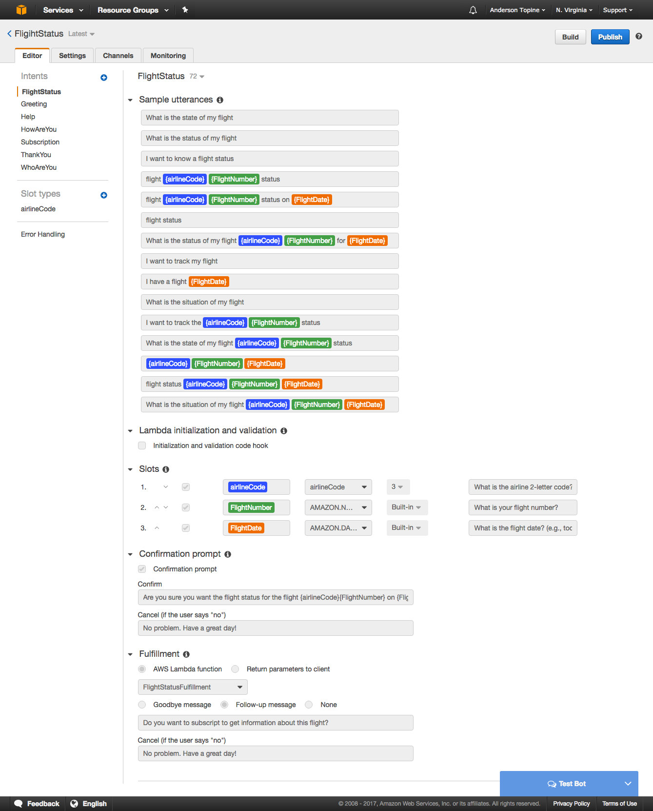

### Greeting Intent
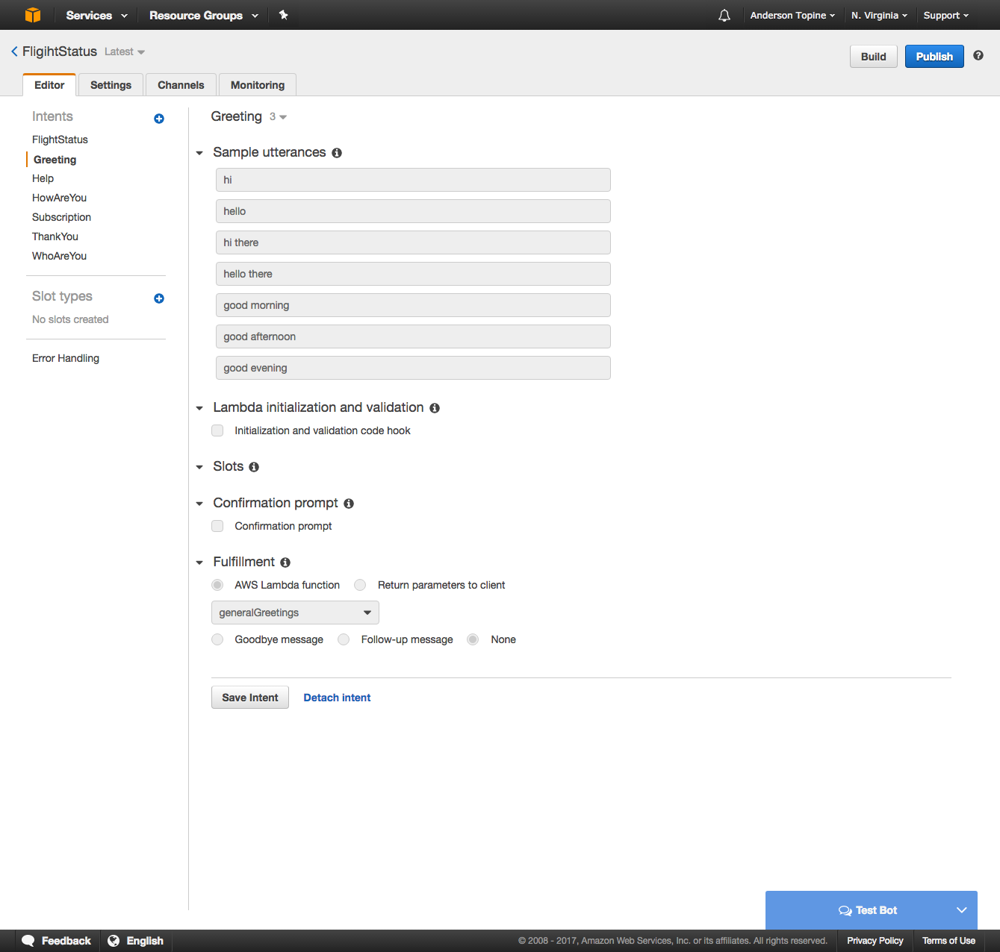

### Help Intent
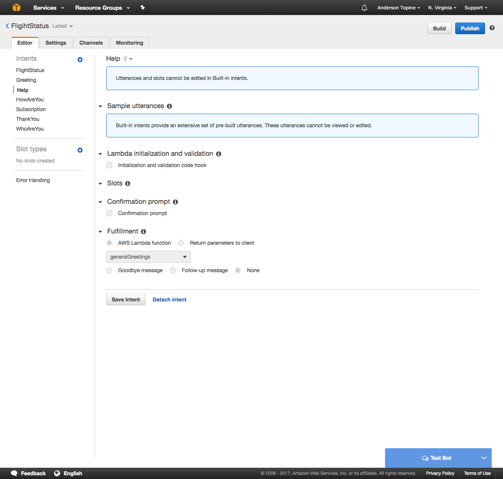

### How Are You Intent
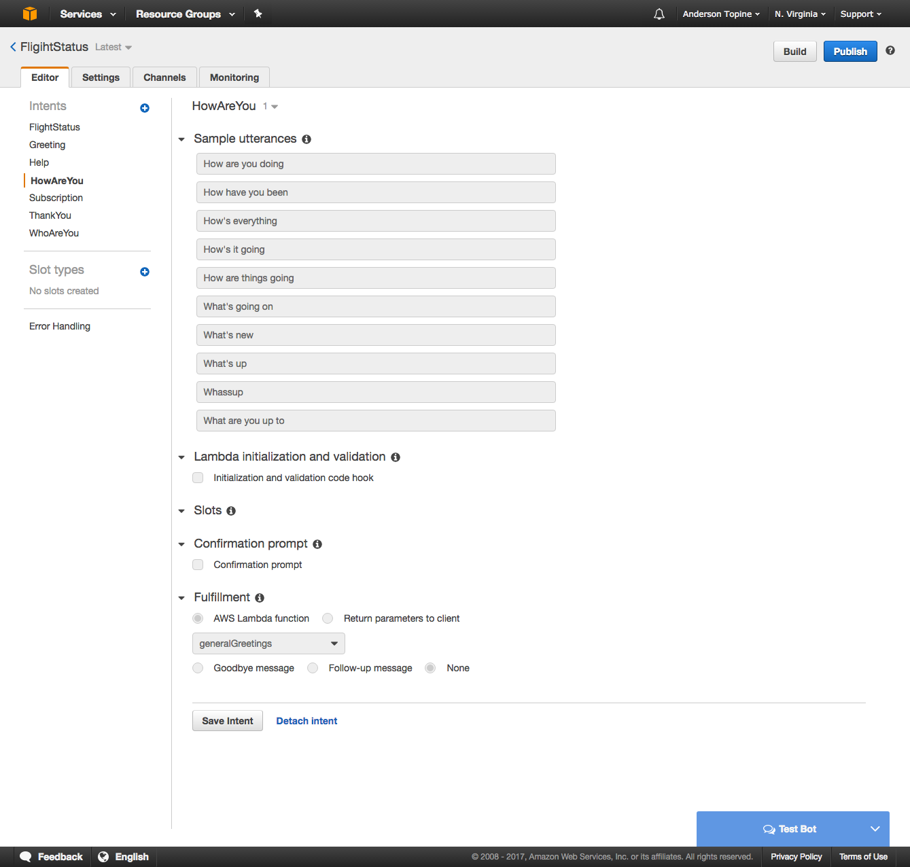

### Subscription Intent
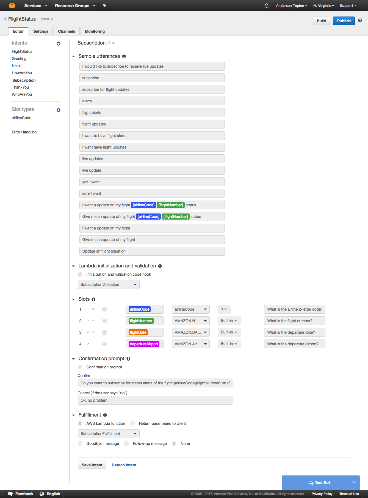

### Thank you
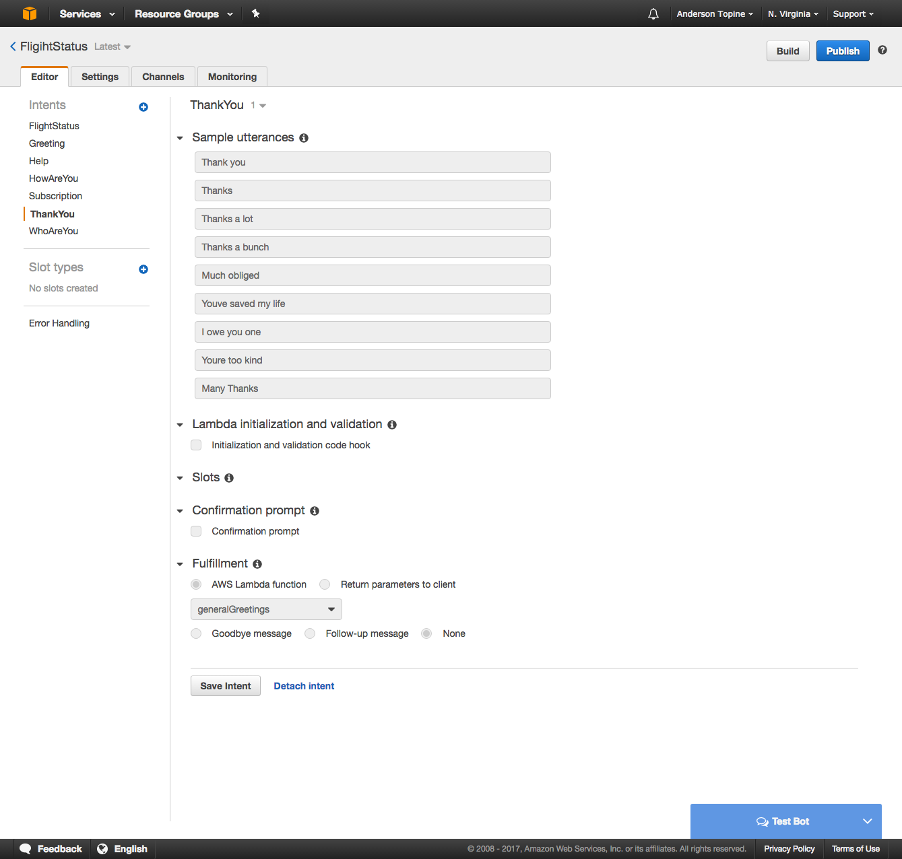

### Who Are You Intent
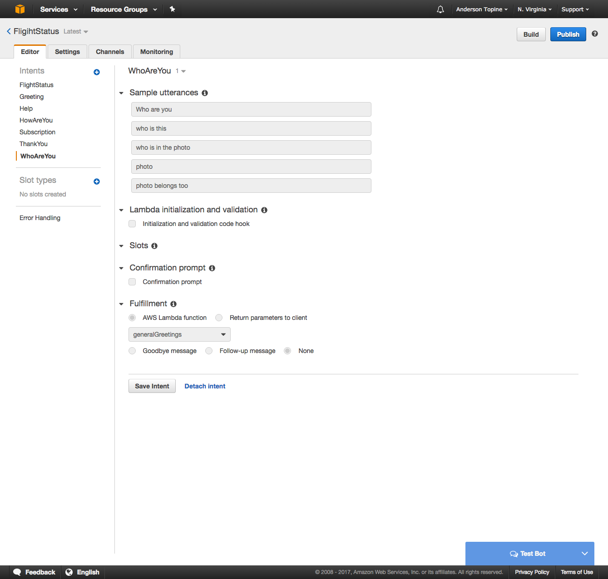

### Airline Code Slot
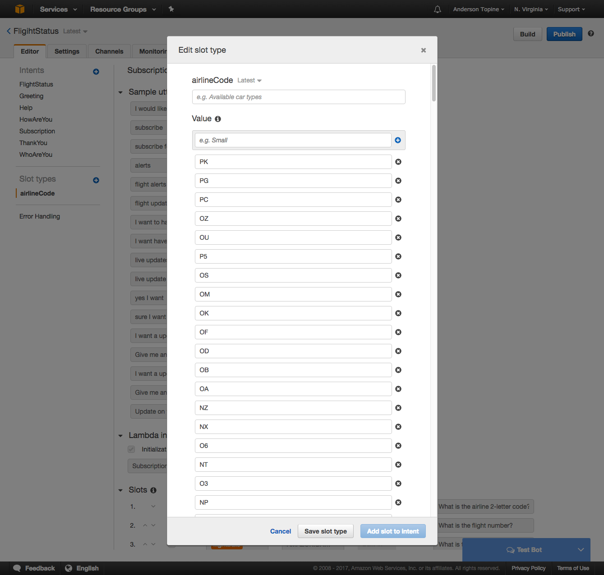

## AWS Lambdas

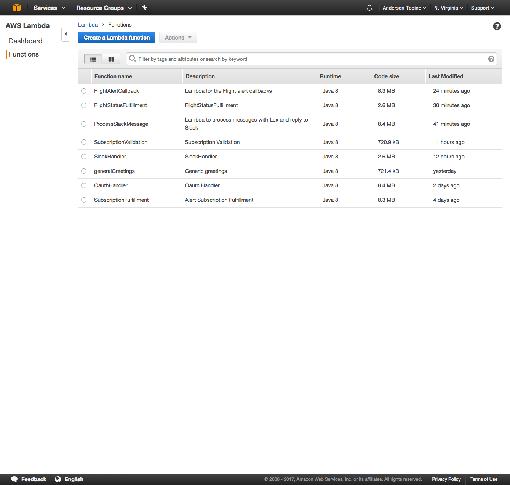

## API Gateway 
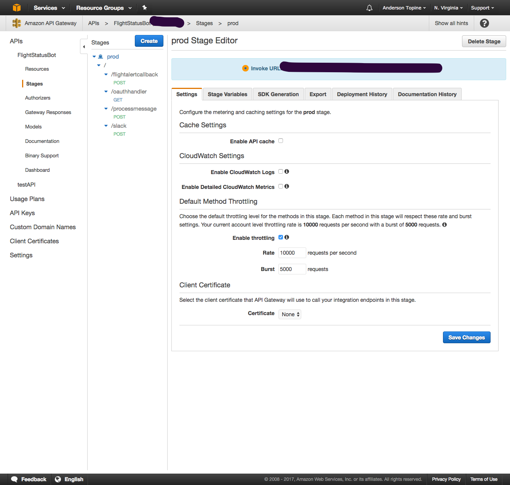

## DynamoDB tables
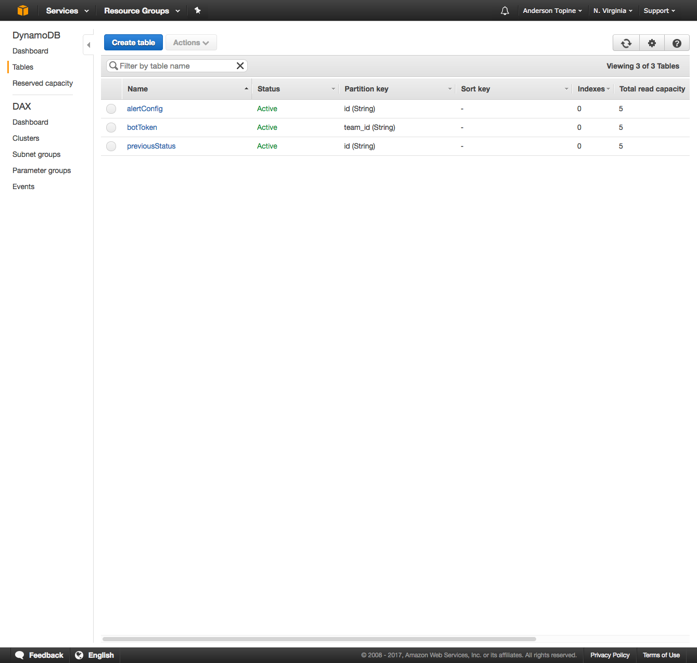