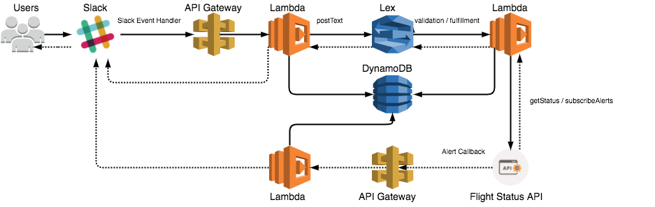

# DumontBot : the serverless flight status conversational Slackbot

Do you want to verify a flight status and get live updates alerts in Slack ?

DumontBot shows the flight status and can notify you with live updates about :

* __Departure__: When the flight depart from the gate.
* __Departure Delay__: When the flight departure is delayed more then 15 minutes.
* __Departure Gate Change__: When the departure gate changes.
* __Arrival__: When the flight lands.
* __Arrival Delay__: When the flight arrival is delayed more then 15 minutes.
* __Baggage Carousel__: Belt number where you baggage will be available to be claimed.

Flight status services are provided by third party provider.

## Demonstration Video

https://youtu.be/6r8en5jwksw

## Add DumontBot to Your Slack Team

DumontBot can be invited to any channel. It will only reply to messages in public or group channels if mentioned : @DumontBot.

For direct messages (DM), the mention is not needed.

## Info

This is a prototype to find an alternative to wit.ai and experiment the following AWS products :

 * __Lex__
 * __Lambda (Java)__
 * __DynamoDB__
 * __API Gateway__
 
Implementation in Java using "normal libraries" to evaluate the lambda running time (including cold start time).

Lots of tests and refactoring needed for a production release.

## Architecture

### Project

One maven module per Lambda to avoid heavy jars (that increase the cold start).

* __oauthHandler__ : Handler for the Oauth Authorization
* __slackEventHandler__ : To decrease the Java cold start time, an initial SlackHandler Lambda was created to dispatch
 the message for an async processing and return the Http 200 response to slack in less then three seconds or Slack will 
 retry to deliver the message three times.  
* __processMessage__ : Lambda responsible to handle the communication with AWS Lex and post messages in Slack.
* __flightStatusFulfillment__ : Fulfillment lambda for the flight status intent. Calls the Flight Status API to retrieve the flight information.
* __subscriptionValidation__ : Lambda for the subscription intent validation. Gets the previous flight status retrieved to populate the slots.
* __subscriptionFulfillment__ : Fulfillment lambda for the subscription intent. Creates a alert subscription in the Flight API sending the url for the callback.
* __flightAlertCallback__: Lambda responsible to receive the alerts callback from the Flight Status API and post the message in Slack.

### AWS Lex Intents
* __FlightStatus__ : Initial intent that retrieve the flight status and save in the dynamoDB the necessary information to start the second intent (AlertSubscription).
* __Subscription__ : Intent to subscribe for flight alerts. Uses the previous flight status retrieved to build the request, otherwise will ask the user for the inputs.
* __Help__: Help intent
* __Greetings__: Greeting intent
* __HowAreYou__: How are you intent
* __WhoAreYou__: Who are you intent
* __ThankYou__: Thank you intent

## AWS Deploy

Configure your local environment with the necessary AWS credentials.
 
You may need to change some code paths.

The deployment tool development is on-going.

Please look the document for manual install and configuration of AWS LEX intents :
[aws deploy doc](AWS-DEPLOY.md)

For the LEX bot export :
[LEX JSON](deployAws/src/main/resources/lex-bot-export.json)

Thank you
